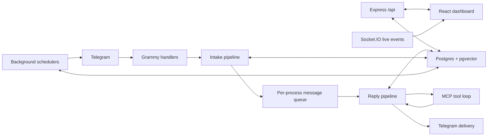

# Design Document

## Purpose

This project is a Telegram bot backed by an OpenAI-compatible API, with a React
dashboard for configuration, state inspection, and debugging. One Node process
runs the Grammy bot, the Express API, Socket.IO live updates, background
schedulers, and, in production, the built dashboard.

The design favors explicit wiring over dynamic discovery:

- Features are plain folders under `server/src/features/<name>`.
- The runtime imports feature hosts, database exports, routers, and MCP tool
  registrars directly.
- The dashboard is a normal Vite React app that talks to the same Express API.
- Postgres is the source of truth for settings, history, memories, summaries,
  tasks, debug traces, and stats.

## Goals

- Keep the bot responsive by separating the reply critical path from slower
  post-reply and background work.
- Let the main reply model decide when to use tools instead of prefetching or
  injecting tool results outside the model's tool-call loop.
- Keep features modular enough to add, remove, test, and expose them in the
  dashboard without introducing separate npm packages.
- Preserve rich debug traces for user-visible turns, scheduled task fires, and
  background jobs.
- Support OpenAI-compatible chat completions backends using standard routes and
  standard request fields.

## Non-goals

- The project is not a multi-service architecture. Bot, API, feature runtime,
  and dashboard serving live in one server process.
- Features are not separate packages. They share server infrastructure directly.
- MCP tools are not a general pre-processing layer. Main-reply tools run only
  when the model emits `tool_calls`.
- The server does not manage backend model context size per request. `numCtx` is
  a local budgeting value used for prompt/history sizing.

## System Overview



Runtime composition starts in `server/src/index.ts`:

1. Validate required environment.
2. Wire dashboard live-event hooks.
3. Initialize Postgres and feature databases.
4. Initialize queue-aware background schedulers.
5. Load in-process MCP tools.
6. Create feature API routers.
7. Start Express, API routes, optional static dashboard serving, and Socket.IO.
8. Start the Telegram bot.
9. Start task, summary, memory, mood, and browser-agent schedulers.
10. Register shutdown handlers for bot, schedulers, Playwright, sockets, and the
    HTTP server.

## Workspaces

| Workspace | Responsibility |
| --- | --- |
| `server/` | Grammy bot, Express API, LLM client, Postgres access, debug recording, background jobs, and all feature logic. |
| `dashboard/` | Vite + React dashboard for settings, operational pages, debug traces, and data inspection. |

The root workspace provides orchestration scripts:

- `npm run dev` starts server and dashboard dev servers.
- `npm test` runs the server test suite.
- `npm run typecheck` checks server and dashboard.
- `npm run build` builds dashboard then server.
- `npm run start` runs the production server build.

## Feature Model

Features live under `server/src/features/<name>/`. A feature may contribute:

| Path | Role |
| --- | --- |
| `*.ts` | Runtime logic: pipeline hosts, prompt builders, parsers, services. |
| `db/*.ts` | Postgres table binding, data access, and optional REST router exports. |
| `register-mcp-tools.ts` | Optional MCP tool registrar. |
| `dashboard/src/features/<name>/*.tsx` | Optional dashboard pages. |

Static feature metadata is declared in `server/src/runtime/feature-registry.ts`.
Pipeline order is declared in `server/src/runtime/feature-hosts.ts`. This keeps
the load order inspectable and avoids manifest/package discovery.

Current feature folders:

| Feature | Design role |
| --- | --- |
| `addressing` | Determines whether a group message is addressed to the bot. |
| `completions` | Builds the main system prompt and produces the primary reply. |
| `history` | Stores chat turns and exposes history retrieval tools. |
| `image-gen` | Generates images by model-called tool when configured. |
| `link-fetch` | Reads web pages through the `read_page` MCP tool. |
| `memory` | Stores raw memory notes and consolidates durable embedded memories. |
| `mood` | Manages personalities, mood state, and mood update side passes. |
| `sticker` | Chooses and sends optional stickers after text delivery. |
| `summaries` | Builds daily chat summaries with embeddings for semantic recall. |
| `tasks` | Owner-managed scheduled chat messages. |
| `vision` | Normalizes Telegram media and attaches current-turn images to the reply model. |
| `web-browse` | Runs an owner-triggered background browser agent. |
| `web-search` | Performs Tavily search through the `search_web` MCP tool. |

## Message Processing Design

Message handling starts in `server/src/bot/handlers/message.ts`. The handler:

1. Allocates a process-local trace id for the turn.
2. Creates a message debug report when chat metadata is available.
3. Ignores bot messages, slash commands, empty messages, and maintenance-blocked
   messages before expensive work.
4. Creates `PipelineHostServices` and an initial `PipelineTurnState`.
5. Runs the intake pipeline.
6. Delivers any early reply, ignores unaddressed messages, or enqueues accepted
   messages for serialized processing.

The intake pipeline runs:

1. `turnSetupHost`
2. `intakeHistoryHost`
3. `addressingHost`

Accepted turns enter `server/src/runtime/message-queue.ts`. The queue is
process-local and processes one turn at a time. It records queue wait and total
turn latency, tracks a history pointer per conversation, and notifies
queue-aware schedulers when activity starts or drains.

Queued processing in `server/src/pipeline/queue-runner.ts` has two phases.

Critical path, before text delivery:

1. `visionReplyHost`
2. `systemPromptHost`
3. `personalityHost`
4. `completionsHost`

Post-reply path, after the text reply is already sent:

1. `stickerPipelineHost`
2. `historyRecordHost`
3. `moodPipelineHost`

This split is intentional. The user sees the text reply before sticker
selection, history recording, or mood update failures can delay or replace it.
Generated images are sent immediately after the text reply. Stickers are sent as
soon as the sticker host picks one.

## Pipeline Contracts

The pipeline is built around `PipelineTurnState`, `PipelineHostServices`, and
`PipelineFeatureHost` in `server/src/contracts/pipeline.ts`.

A pipeline host has:

- `id`
- `stepId`
- optional `alwaysOn`
- optional `debugTitle`
- optional `shouldRun(state, services)`
- required `run(state, services)`

Hosts mutate shared turn state and return a `PipelineStepResult` for tracing.
Services provide logging, LLM helpers, workflow-step settings, and debug report
writers. Features import concrete server helpers directly rather than receiving
large callback objects.

## LLM Design

The LLM client uses OpenAI-compatible chat completions. Requests are built from
standard fields such as:

- `model`
- `messages`
- `max_tokens`
- `temperature`
- `top_p`
- `reasoning_effort` when thinking is enabled
- `chat_template_kwargs: { enable_thinking: false }` when thinking is disabled
- `response_format`
- `tools`
- `stop`

The main reply may use tools through `chatCompleteWithTools` in
`server/src/llm/tool-loop.ts`. Tool use is a single conversation:

1. Send system prompt, messages, response format, and enabled OpenAI tool specs.
2. If the model returns no tool calls, that response is the reply.
3. If the model returns tool calls, execute them through `BotMcpRegistry`.
4. Append tool results to the same conversation.
5. Repeat until the model answers.
6. If the model stops making progress by repeating the same calls, remove tools
   for one forced final answer and return `loopDetected: true`.

Tool results that include images are appended as a follow-up user message with
image content, because OpenAI tool-role messages cannot carry images directly.

Auxiliary passes use lower-cost settings and low reasoning effort when thinking
is enabled. JSON output parsers read user-facing fields from `message.content`;
reasoning fields are recorded for diagnostics but are not merged into replies.

## MCP Tool Design

`server/src/runtime/mcp-tools.ts` loads every feature registrar from the static
feature registry into one `BotMcpRegistry`.

Tools are enabled by:

- workflow steps for optional tools such as `read_page` and `search_web`;
- `alwaysOn` registry entries for history, memory, summaries, tasks, and
  browser enqueueing tools;
- setting gates such as `imageModel` for image generation.

The system prompt's `## Tools` section is generated from the enabled tool set.
Tool guidance has one source of truth in each feature's guidance module and is
rendered both into MCP tool descriptions and the system prompt.

Important boundary: main-reply MCP tools run only when the model calls them.
The server does not prefetch URLs, force search, or inject tool results into the
prompt outside a tool-call round.

## Storage Design

Postgres is initialized in `server/src/db/index.ts`; the pool wrapper is in
`server/src/db/pool.ts`. Startup creates the `vector` extension and core tables,
then binds feature-owned tables from `FEATURE_REGISTRY`.

Core storage responsibilities:

| Data | Design |
| --- | --- |
| Settings | Key/value JSON rows in `settings`; dashboard is the main editor. |
| Stats | Counter rows in `stats` plus metadata in `stats_meta`. |
| History | Raw `chat_messages` with full-text search support. |
| Summaries | Daily topic summaries with `vector(1024)` embeddings. |
| Memory | Raw `memory_entry` notes and consolidated embedded `memory` records. |
| Tasks | `tasks`, `task_messages`, lifecycle `task_events`, and task debug traces. |
| Debug traces | Shared processing entries plus domain owner tables for messages, tasks, jobs, and browser runs. |
| Timing and usage | Phase timings and per-call LLM token usage for dashboard diagnostics. |

Feature DB exports follow the `FeatureDbExports` contract:

- `bindFeatureDatabase(database)`
- optional `configureFeatureAccess(host)`
- optional `createFeatureRouter()`

Feature routers are mounted by API base path through `createApiRouter`.

## Dashboard Design

The dashboard is a Vite React app under `dashboard/`. `dashboard/src/App.tsx`
defines route-level pages:

- overview
- character
- history and summaries debug
- memory and memory debug
- mood
- tasks and task debug
- vision
- browser runs
- settings
- debug traces
- raw data inspection

`dashboard/src/api.ts` is the typed API client. In development, Vite serves the
dashboard and proxies API requests. In production, the server serves
`dashboard/dist` when the built `index.html` exists.

Socket.IO live events update high-churn dashboard data without requiring manual
refreshes. Event types include stats, settings, mood, personalities, memory,
debug, and data-table changes.

## Background Work

Background systems are started explicitly from `server/src/index.ts`.

| Worker | Behavior |
| --- | --- |
| Mood cooldown worker | Advances mood state over time. |
| Task scheduler | Fires enabled owner-created tasks at wall-clock times; paused during maintenance mode. |
| Summaries scheduler | Processes completed chat days while respecting queue activity. |
| Memory scheduler | Consolidates raw memory entries into durable embedded memories while the message queue is idle. |
| Vision backfill scheduler | Queue-aware media backfill for historical rows. |
| Browser agent runner | Processes queued owner-triggered browser runs with configured concurrency. |

Queue-aware workers receive activity and drained signals from
`runtime/background-jobs.ts` and avoid competing with active message replies.
The task scheduler is independent of the message queue because tasks are
wall-clock events.

## Web Browsing Agent

The web-browse feature is intentionally separate from the main reply path. The
main model can call `browse_web(goal)`, but that tool only enqueues a
`browser_agent_runs` row and returns quickly. The runtime browser runner later
uses Playwright and its own LLM tool loop to navigate, inspect, extract media,
download files, and report back into the chat.

This design keeps long browsing sessions, downloads, and multi-page workflows
out of the normal message queue. Browser run status and debug traces are exposed
through the dashboard browser page and debug APIs.

## Observability

The project records several layers of operational data:

- Structured event logs for lifecycle and error events.
- Message processing traces for addressed and ignored turns.
- Task fire traces.
- Scheduled job traces.
- Browser-agent traces.
- Per-phase latency samples.
- Per-call and lifetime LLM token usage.

`ProcessingRecorder` is domain-agnostic. Each debug domain supplies a sink that
writes to its own owner table and shared ordered entry rows. The LLM client can
attach request/response entries to any active recorder by trace id.

The dashboard renders these traces using shared debug components so message,
task, job, and browser entries have a consistent inspection model.

## Configuration

Environment variables configure process-level dependencies and secrets:

- `BOT_TOKEN`
- `LLM_BASE_URL`
- optional `LLM_API_KEY`
- `DATABASE_URL`
- optional embedding base URL and key
- optional `TAVILY_API_KEY`
- `LOGGING_LEVEL`
- `TZ`
- optional `PUBLIC_URL` for read-only live deployment inspection

Each variable also supports a `<NAME>_FILE` variant for Docker secrets. Model
selection, prompt text, owner identity, maintenance mode, workflow steps,
performance limits, personality, mood, image model, browser limits, and feature
settings live in Postgres and are edited through the dashboard.

## Deployment

Local development usually runs:

```bash
npm install
cp .env.example .env
docker compose up -d db
npm run dev
```

Production build:

```bash
npm run build
npm run start
```

Docker deployment uses `docker compose up -d --build`. The production image
serves the built dashboard from the same Express process as the API and bot.

## Testing and Quality Gates

Post-task gates are:

```bash
npm test
npm run typecheck
npm run build
```

Focused development commands are available per workspace, but the root commands
are the project-level gates. Server tests use Vitest. Optional live LLM suites
exist for behavior that requires a configured backend.

When adding or changing a feature, tests should be placed under
`server/test/features/<name>/` or the appropriate shared/unit test area.
Prompt/tool guidance changes should include prompt tests when they affect the
rendered system prompt.

## Adding a Feature

To add a feature:

1. Create `server/src/features/<name>/`.
2. Implement one or more pipeline hosts if the feature participates in message
   processing.
3. Add hosts to the appropriate order in `server/src/runtime/feature-hosts.ts`.
4. Add metadata, DB exports, and MCP registrar entries to
   `server/src/runtime/feature-registry.ts`.
5. Add feature database binding and a router under `db/` when persistent state
   or dashboard APIs are needed.
6. Add a dashboard page under `dashboard/src/features/<name>/` and route it in
   `dashboard/src/App.tsx` when UI is needed.
7. Put shared cross-feature helpers in `server/src/shared/`.
8. Add tests under `server/test/features/<name>/` or the closest shared test
   area.
9. Update `AGENTS.md`, `README.md`, and this document if the change affects
   workflows, commands, architecture, feature behavior, or agent expectations.

To remove a feature, delete its feature folder, registry entry, pipeline hosts,
dashboard routes/pages, tests, and docs in the same task.

## Design Constraints

- Keep terminology provider-neutral: use "OpenAI-compatible API", "provider",
  or "backend".
- Keep MCP tools model-driven. Do not add code paths that auto-run tools based
  only on message text.
- Keep main reply latency protected. Move optional or slow work after text
  delivery or into a background worker when feasible.
- Keep feature wiring explicit in runtime files.
- Keep database access async through the shared `SqlDatabase` handle.
- Keep generated debug and telemetry data out of fixtures and committed test
  data when it comes from a live deployment.
- Keep dashboard settings and server runtime assumptions in sync, especially
  derived prompt/history limits.
